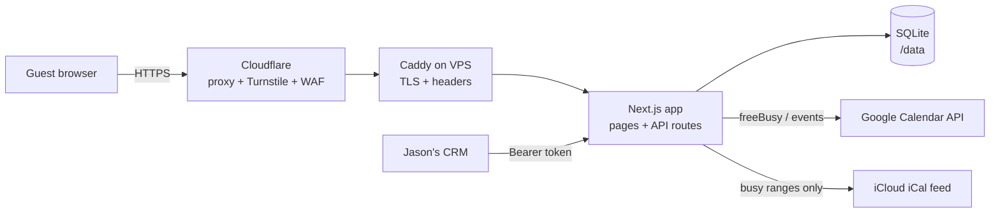
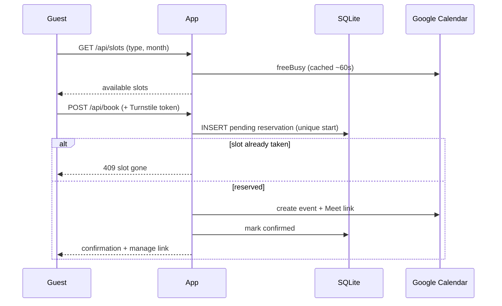
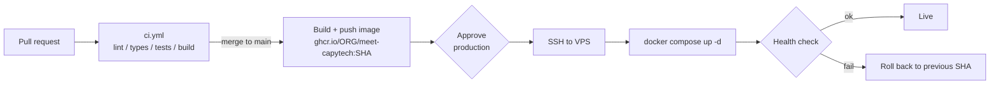

# meet.capytech.co.uk — Booking Service Documentation

> **Status:** Planning. A working prototype exists (zero-dependency Node + vanilla HTML). This document defines the production build.
> **Confidentiality:** Do not put real calendar IDs, private iCal links, tokens or personal email addresses in this repository. Everything sensitive lives in environment variables on the server and in GitHub Secrets.

---

## 1. What this project is about

### 1.1 Purpose

A public "book a meeting with Jason" page for Capytech UK, hosted at `meet.capytech.co.uk`. A prospective customer picks a meeting type, a day and a time, enters their details, and immediately receives a calendar invite with a video link. No back-and-forth emails.

### 1.2 What it does

| Capability | Description |
|---|---|
| Availability | Reads free/busy from several calendars (Google Workspace, other Google calendars, and an iCloud calendar via a private iCal feed) and only offers times where Jason is genuinely free |
| Meeting types | Quick intro (15 min), Discovery call (30 min), Product demo (60 min). Configurable |
| Rules | Working hours, buffers between meetings, minimum notice, maximum meetings per day, booking window, UK bank holidays |
| Booking | Creates a Google Calendar event with a Google Meet link (or Zoom room link if enabled) and emails the guest |
| Guest self-service | Cancel or reschedule from a private link in the invite |
| Time zones | Guest sees times in their own zone (important for our GCC customers) |
| CRM sync | Jason's local CRM pulls bookings and pushes availability rules through a token-protected API |
| Safety | Fails closed: if any calendar cannot be read, no times are offered, so double-booking cannot happen silently |

### 1.3 Users

- **Guest** (public): books, cancels, reschedules.
- **Host** (Jason): connects Google once, receives events in his calendar.
- **CRM** (machine): reads bookings, updates configuration.
- **Dev team**: builds, deploys and operates it.

### 1.4 Goals and non-goals

**Goals:** reliable (never double-book), fast to use on mobile, simple to operate on one small VPS, UK/EU data residency, easy to hand over.

**Non-goals (for now):** multiple hosts, payments, Microsoft Teams links (we run Google Workspace), a full admin dashboard UI, SMS reminders.

### 1.5 Architecture



### 1.6 Core flow: booking a slot



The unique reservation row is what prevents two guests taking the same slot at the same moment.

### 1.7 Screens (wireframes)

**Booking page (desktop, three panes)**

```
┌──────────────────────────────────────────────────────────────┐
│ ▣ CAPYTECH UK                          meet.capytech.co.uk    │
├───────────────┬──────────────────────────┬───────────────────┤
│ (JS) Jason    │  October 2026     ‹  ›   │ Thursday 8 October │
│ COO, Capytech │  MON TUE WED THU FRI …   │ ┌───────────────┐ │
│               │   …  …  …  [8] …         │ │    09:00      │ │
│ MEETING TYPE  │                          │ │    09:30      │ │
│ ○ Quick intro │  🌐 Europe/London  ▾     │ │    10:00  ◄── │ │
│ ● Discovery   │                          │ └───────────────┘ │
│ ○ Demo        │                          │ Name / Email /    │
│               │                          │ Company / Notes   │
│               │                          │ [Confirm booking] │
└───────────────┴──────────────────────────┴───────────────────┘
```

**Mobile:** single column. Type → calendar → slots (grid) → form.

**Confirmation:** full-card success state with date, time, video link and "Add to calendar" and "Manage booking" actions.

**Manage page (`/manage/[token]`):** booking summary, **Reschedule** (book the new slot first, then release the old one), **Cancel**.

---

## 2. Tech stack

The prototype is vanilla JS plus a hand-rolled iCal parser and hand-rolled HTTP server. The production build replaces each of those with a maintained, typed tool.

| Layer | Choice | Replaces | Why |
|---|---|---|---|
| Language | **TypeScript** (strict) | untyped JS | Catches date/slot bugs at compile time |
| Framework | **Next.js** (App Router, `output: 'standalone'`) | vanilla HTML + custom `http` server | One codebase for UI and API, small Docker image, routing and headers built in |
| UI | **React** + **Tailwind CSS** + **Radix UI primitives** (shadcn/ui pattern) | hand-written CSS/DOM code | Accessible calendar, select and dialog components, consistent design tokens |
| Forms/validation | **React Hook Form** + **Zod** (shared client/server schemas) | manual `clean()` checks | One schema validates both sides |
| Data fetching | **TanStack Query** | hand-rolled `fetch` and state | Caching, loading and error states for slots |
| Dates/time zones | **Luxon** (or date-fns-tz) | hand-rolled `londonToUtc` | Correct DST handling, including 23h/25h days |
| Database | **SQLite** via **Drizzle ORM** + `better-sqlite3`, migrations in repo | raw `node:sqlite` + key/value table | Typed schema, real migrations, unique indexes for slot reservation |
| Google | **googleapis** official client | raw `fetch` to Google | Typed, token refresh handled |
| iCal | **node-ical** + **rrule** | hand-rolled recurrence expansion | Standards-compliant recurrence handling |
| Anti-abuse | **Cloudflare Turnstile**, per-IP and per-email rate limits | honeypot + in-memory map | Stops invite-spam through Jason's account |
| Logging | **pino** (JSON) | `console.error` | Structured logs for the VPS |
| Tests | **Vitest** (unit), **Playwright** (end-to-end) | none | Slot engine and booking flow covered |
| Quality | ESLint, Prettier, `tsc --noEmit`, Husky + lint-staged | none | Consistent code, blocked bad commits |
| Container | **Docker** (multi-stage, non-root) + **Docker Compose** | single Dockerfile | Reproducible on the VPS |
| Reverse proxy | **Caddy** | none | Automatic TLS or Cloudflare origin cert, security headers |
| CI/CD | **GitHub Actions** + **GHCR** (GitHub Container Registry) | manual `docker run` | See section 4 |
| Backups | SQLite `.backup` on cron (or **Litestream**) to off-box storage | none | Guest data is recoverable |

### 2.1 Repository layout

```
meet-capytech/
├─ src/
│  ├─ app/                  # Next.js routes: /, /manage/[token], /api/*
│  ├─ components/           # UI (calendar, slot list, booking form)
│  ├─ lib/
│  │  ├─ slots/             # availability engine (pure, unit-tested)
│  │  ├─ calendars/         # google.ts, ics.ts, busy-cache.ts
│  │  ├─ booking/           # reserve, confirm, cancel, reschedule
│  │  ├─ security/          # auth, rate limit, turnstile, crypto
│  │  └─ db/                # drizzle schema + migrations
│  └─ env.ts                # Zod-validated environment
├─ tests/                   # vitest + playwright
├─ deploy/                  # docker-compose.yml, Caddyfile, scripts
├─ .github/workflows/       # ci.yml, deploy.yml
├─ Dockerfile
└─ docs/                    # this document
```

### 2.2 Data model

| Table | Key fields |
|---|---|
| `bookings` | id, type_slug, starts_at (UTC ISO), ends_at, name, email, company, notes, status (`pending` / `confirmed` / `cancelled`), event_id, manage_token_hash, created_at, updated_at (ISO UTC) |
| unique index | `(starts_at)` where status in (`pending`, `confirmed`) — prevents double-booking |
| `settings` | working hours, buffers, notice, max per day, window, step, meeting types |
| `google_tokens` | encrypted refresh/access tokens, connected account |
| `busy_cache` | calendar source, from/to, **busy ranges only** (never event titles or details), fetched_at |

### 2.3 Environment variables

| Variable | Purpose |
|---|---|
| `BASE_URL` | Public URL, e.g. `https://meet.capytech.co.uk` |
| `DATA_DIR` | SQLite location (mounted volume) |
| `ADMIN_TOKEN` | Bearer token for the CRM and admin endpoints |
| `ENCRYPTION_KEY` | Separate key for encrypting Google tokens at rest |
| `GOOGLE_CLIENT_ID` / `GOOGLE_CLIENT_SECRET` | OAuth client |
| `HOST_EMAIL` | Calendar owner who connects Google |
| `BUSY_CALENDARS` | Comma-separated calendar IDs (no defaults in code) |
| `ICS_FEEDS` | Private iCal URLs (secret) |
| `ICS_BLOCK_ALL_DAY` | `1` to let all-day events block the whole day |
| `ZOOM_LINK` | Optional personal Zoom room |
| `TURNSTILE_SITE_KEY` / `TURNSTILE_SECRET` | Bot protection |

---

## 3. Development roadmap

Status key: ⬜ not started · 🟨 in progress · ✅ done. Update the checklist and the "What it can do so far" line as each milestone lands.

### Progress at a glance

| Milestone | Name | Status |
|---|---|---|
| M0 | Prototype review and documentation | 🟨 |
| M1 | Foundation | ⬜ |
| M2 | Availability engine | ⬜ |
| M3 | Booking and Google integration | ⬜ |
| M4 | Guest self-service | ⬜ |
| M5 | UI/UX build-out | ⬜ |
| M6 | CRM sync and admin API | ⬜ |
| M7 | Hardening and launch | ⬜ |
| M8 | Post-launch improvements | ⬜ |

### M0 — Prototype review and documentation 🟨

- [x] Review prototype code and setup instructions
- [x] Security and correctness review completed
- [ ] This document approved
- [ ] Wireframes approved
- [ ] Stack confirmed

**What it can do so far:** nothing in production. The prototype demonstrates the booking flow end to end but has known issues (double-booking race, private data in config, CRM date filter bug, Docker volume permissions).

### M1 — Foundation

- [ ] Repo created, TypeScript + Next.js + Tailwind scaffolded
- [ ] ESLint, Prettier, Husky, Vitest configured
- [ ] Zod-validated `env.ts`; no secrets or defaults with personal data in code
- [ ] Drizzle schema, migrations, SQLite on `/data`
- [ ] Dockerfile (multi-stage, non-root, `/data` owned by `node`) and Compose file
- [ ] `ci.yml` running lint, typecheck, test, build on every pull request
- [ ] `/api/health` endpoint

**What it can do so far:** an empty app builds, passes CI, runs in Docker locally and returns a health check.

### M2 — Availability engine

- [ ] Pure slot generator (hours, buffers, notice, window, step, max per day) with Luxon
- [ ] UK bank holidays (cached)
- [ ] Google freeBusy adapter, 60-second cache, fails closed
- [ ] iCal adapter using node-ical + rrule, stores busy ranges only
- [ ] Mock calendar mode for development
- [ ] Unit tests including DST change days and recurring events

**What it can do so far:** `GET /api/slots` returns correct, cached availability across all calendars, and refuses to answer if any calendar is unreadable.

### M3 — Booking and Google integration

- [ ] Google OAuth connect flow (one-time, state validated and single-use)
- [ ] Encrypted token storage with separate `ENCRYPTION_KEY`
- [ ] Reserve-then-confirm booking (unique index), rollback on Google failure
- [ ] Event creation with Meet link or Zoom link, invite emailed to guest
- [ ] Turnstile + per-IP and per-email rate limits
- [ ] Input validation (Zod) and sanitised event text

**What it can do so far:** a guest can book a slot via the API and Jason's calendar shows the event; two simultaneous requests for one slot result in exactly one booking.

### M4 — Guest self-service

- [ ] Hashed manage tokens
- [ ] Cancel (surfaces and retries Google failures, never silently)
- [ ] Reschedule: book new slot first, then release the old one
- [ ] Optional change cutoff (for example, 2 hours before start)

**What it can do so far:** guests can cancel or move a booking safely without ever losing their original slot by accident.

### M5 — UI/UX build-out

- [ ] Wireframes implemented as components (mobile first)
- [ ] Calendar, slot list, time zone selector, booking form, confirmation
- [ ] Slots re-grouped by the guest's local date
- [ ] Keyboard navigation, visible focus, aria labels
- [ ] Self-hosted fonts, English (UK) copy; Arabic/RTL scoped as a later option
- [ ] Playwright end-to-end tests for the main flows

**What it can do so far:** the full guest experience works on phone and desktop and passes accessibility checks.

### M6 — CRM sync and admin API

- [ ] `GET /api/admin/bookings?since=&limit=` with ISO UTC timestamps and paging
- [ ] `POST /api/admin/config` for hours, buffers and meeting types
- [ ] `GET /api/admin/status` (Google connection, last freeBusy problems)
- [ ] Bearer-header auth only, constant-time compare
- [ ] API documented (OpenAPI or markdown)

**What it can do so far:** the CRM can reliably pull every booking change and update availability rules.

### M7 — Hardening and launch

- [ ] Security headers and CSP via Caddy and Next config
- [ ] Origin locked to Cloudflare, SSL "Full (strict)", WAF rate limit on `POST /api/book`
- [ ] Backups running and a restore test completed
- [ ] `deploy.yml` deploying to the VPS with health check and automatic rollback
- [ ] Staging deployment dry run
- [ ] Privacy notice and data retention policy confirmed
- [ ] Production Google OAuth connected, `ADMIN_TOKEN` handed to Jason securely

**What it can do so far:** live at `meet.capytech.co.uk`.

### M8 — Post-launch

- [ ] Email reminders, optional buffers by meeting type
- [ ] Multiple hosts or team round-robin
- [ ] Lightweight admin dashboard
- [ ] Arabic/RTL booking page for the GCC audience
- [ ] Uptime monitoring and alerting

---

## 4. Deployment on our own VPS from GitHub with GitHub Actions

### 4.1 Strategy

1. Every push and pull request runs **CI** (lint, typecheck, tests, build).
2. A merge to `main` builds a Docker image, tags it with the commit SHA, and pushes it to **GHCR**.
3. The deploy job connects to the VPS over SSH, pulls that exact image, restarts the service with Docker Compose, checks `/api/health`, and **rolls back** to the previous image if the check fails.
4. Production deploys require manual approval through a GitHub **Environment** (`production`).



### 4.2 One-time VPS setup

Use a UK/EU region (for example London). Ubuntu LTS, at least 1 vCPU / 1 GB RAM, 1 GB+ persistent disk.

1. **Create a deploy user and lock down SSH**
   ```bash
   adduser deploy && usermod -aG docker deploy
   # key-only login, no root login, no password auth
   ```
2. **Firewall:** allow 22 (ideally restricted to your IPs), 80, 443 only.
   ```bash
   ufw default deny incoming && ufw allow 22 && ufw allow 80 && ufw allow 443 && ufw enable
   ```
3. **Install Docker Engine and the Compose plugin**, then log in to GHCR with a read-only token (`read:packages`):
   ```bash
   echo "$GHCR_READ_TOKEN" | docker login ghcr.io -u <github-user> --password-stdin
   ```
4. **Create the app directory**
   ```bash
   mkdir -p /srv/meet/{data,caddy} && chown -R 1000:1000 /srv/meet/data
   ```
   The `chown` matters: the container runs as the non-root `node` user and must be able to write to `/data`.
5. **Create `/srv/meet/.env`** (mode `600`, never committed) with the variables from section 2.3.
6. **DNS (Cloudflare):** `meet.capytech.co.uk` → VPS IP, proxy on, SSL mode **Full (strict)**. Install a Cloudflare Origin Certificate in Caddy, or let Caddy obtain its own certificate.
7. **Restrict the origin to Cloudflare:** allow ports 80/443 only from Cloudflare IP ranges so `cf-connecting-ip` can be trusted and the origin cannot be hit directly.

### 4.3 Files on the VPS

`/srv/meet/docker-compose.yml`

```yaml
services:
  app:
    image: ghcr.io/ORG/meet-capytech:${APP_TAG:-latest}
    restart: unless-stopped
    env_file: .env
    environment:
      NODE_ENV: production
      DATA_DIR: /data
    volumes:
      - ./data:/data
    healthcheck:
      test: ["CMD", "wget", "-qO-", "http://localhost:8080/api/health"]
      interval: 15s
      timeout: 3s
      retries: 5
    expose:
      - "8080"

  caddy:
    image: caddy:2
    restart: unless-stopped
    ports:
      - "80:80"
      - "443:443"
    volumes:
      - ./caddy/Caddyfile:/etc/caddy/Caddyfile:ro
      - caddy_data:/data
    depends_on:
      - app

volumes:
  caddy_data:
```

`/srv/meet/caddy/Caddyfile`

```
meet.capytech.co.uk {
  encode zstd gzip
  header {
    Strict-Transport-Security "max-age=31536000; includeSubDomains"
    X-Content-Type-Options "nosniff"
    Referrer-Policy "same-origin"
    Content-Security-Policy "default-src 'self'; script-src 'self' https://challenges.cloudflare.com; frame-src https://challenges.cloudflare.com; style-src 'self' 'unsafe-inline'; img-src 'self' data:; frame-ancestors 'none'"
  }
  reverse_proxy app:8080
}
```

(Adjust the CSP once the final build is known; Next.js inline scripts may need nonces.)

`/srv/meet/deploy.sh` (called by the workflow)

```bash
#!/usr/bin/env bash
set -euo pipefail
cd /srv/meet
NEW_TAG="$1"
PREV_TAG="$(cat .current_tag 2>/dev/null || echo latest)"

export APP_TAG="$NEW_TAG"
docker compose pull app
docker compose up -d app

# wait up to ~60s for a healthy container
for i in $(seq 1 12); do
  if docker compose exec -T app wget -qO- http://localhost:8080/api/health >/dev/null 2>&1; then
    echo "$NEW_TAG" > .current_tag
    docker image prune -f >/dev/null
    echo "Deployed $NEW_TAG"
    exit 0
  fi
  sleep 5
done

echo "Health check failed, rolling back to $PREV_TAG" >&2
export APP_TAG="$PREV_TAG"
docker compose up -d app
exit 1
```

### 4.4 GitHub setup

**Repository secrets / environment secrets** (Settings → Environments → `production`, with required reviewers):

| Secret | Value |
|---|---|
| `VPS_HOST` | Server IP or hostname |
| `VPS_USER` | `deploy` |
| `VPS_SSH_KEY` | Private key for a deploy-only SSH key pair |
| `VPS_KNOWN_HOSTS` | Output of `ssh-keyscan <host>` (prevents man-in-the-middle) |

The image push uses the built-in `GITHUB_TOKEN` (`packages: write`), so no extra registry secret is needed. Application secrets (`ADMIN_TOKEN`, Google credentials, etc.) stay in `/srv/meet/.env` on the server and are never stored in GitHub.

### 4.5 Workflows

`.github/workflows/ci.yml`

```yaml
name: CI
on:
  pull_request:
  push:
    branches: [main]

jobs:
  test:
    runs-on: ubuntu-latest
    steps:
      - uses: actions/checkout@v4
      - uses: actions/setup-node@v4
        with:
          node-version: 24
          cache: npm
      - run: npm ci
      - run: npm run lint
      - run: npx tsc --noEmit
      - run: npm test
      - run: npm run build
```

`.github/workflows/deploy.yml`

```yaml
name: Deploy
on:
  push:
    branches: [main]
  workflow_dispatch:

concurrency:
  group: deploy-production
  cancel-in-progress: false

env:
  IMAGE: ghcr.io/${{ github.repository }}

jobs:
  build:
    runs-on: ubuntu-latest
    permissions:
      contents: read
      packages: write
    steps:
      - uses: actions/checkout@v4
      - uses: docker/setup-buildx-action@v3
      - uses: docker/login-action@v3
        with:
          registry: ghcr.io
          username: ${{ github.actor }}
          password: ${{ secrets.GITHUB_TOKEN }}
      - uses: docker/build-push-action@v6
        with:
          context: .
          push: true
          tags: |
            ${{ env.IMAGE }}:${{ github.sha }}
            ${{ env.IMAGE }}:latest
          cache-from: type=gha
          cache-to: type=gha,mode=max

  deploy:
    needs: build
    runs-on: ubuntu-latest
    environment: production        # requires manual approval
    steps:
      - name: Set up SSH
        run: |
          install -m 700 -d ~/.ssh
          echo "${{ secrets.VPS_SSH_KEY }}" > ~/.ssh/id_ed25519
          chmod 600 ~/.ssh/id_ed25519
          echo "${{ secrets.VPS_KNOWN_HOSTS }}" > ~/.ssh/known_hosts
      - name: Deploy
        run: |
          ssh ${{ secrets.VPS_USER }}@${{ secrets.VPS_HOST }} \
            "/srv/meet/deploy.sh ${{ github.sha }}"
      - name: Smoke test
        run: curl --fail --silent https://meet.capytech.co.uk/api/health
```

Keep `docker-compose.yml`, `Caddyfile` and `deploy.sh` in the repo under `deploy/` and copy them to the VPS when they change (a small `scp` step or a manual update; they change rarely).

### 4.6 Releasing and rolling back

- **Normal release:** merge to `main` → CI passes → approve the `production` deployment in GitHub → live in about two minutes.
- **Automatic rollback:** `deploy.sh` restores the previous tag if the health check fails.
- **Manual rollback:** run the workflow again from an older commit (`workflow_dispatch`), or on the server: `cd /srv/meet && APP_TAG=<old-sha> docker compose up -d app`.
- **Database migrations:** run on app start (Drizzle). Make them additive (add columns and tables, do not drop) so a rollback to the previous image still works.

### 4.7 Operations

| Task | How |
|---|---|
| Logs | `docker compose logs -f app` (pino JSON) |
| Status | `GET /api/admin/status` with the Bearer token |
| Backups | Nightly cron: `sqlite3 /srv/meet/data/booking.db ".backup '/srv/backups/booking-$(date +%F).db'"`, copied off the server; keep 30 days. Restore-test quarterly |
| Rotate `ADMIN_TOKEN` | Update `.env`, restart, give the new value to the CRM. (With a separate `ENCRYPTION_KEY`, Google does not need reconnecting.) |
| Rotate the iCloud link | Regenerate in iCloud, update `ICS_FEEDS` in `.env`, restart |
| Reconnect Google | Visit `/api/admin/connect` as the host and sign in again |
| Updates | Dependabot for npm and GitHub Actions; base image refreshed on each build |

### 4.8 Pre-launch deployment checklist

- [ ] VPS hardened (key-only SSH, firewall, automatic security updates)
- [ ] `/srv/meet/data` owned by uid 1000 and included in backups
- [ ] `.env` present, permissions `600`, no placeholder values
- [ ] Cloudflare: proxied, Full (strict), Turnstile keys set, WAF rate limit on `POST /api/book`
- [ ] Origin reachable only from Cloudflare
- [ ] Google OAuth consent screen set to Internal; redirect URI matches `BASE_URL`
- [ ] Free/busy sharing confirmed for every calendar; `/api/admin/status` shows no problems
- [ ] Test booking made, cancelled and rescheduled end to end
- [ ] Rollback tested once on staging
- [ ] Backup restore tested
